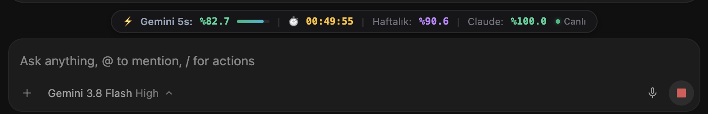
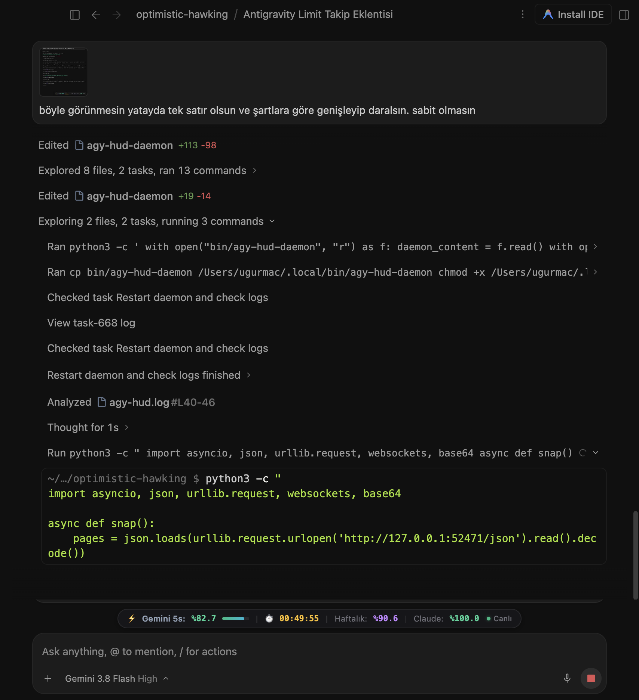

<p align="center">
  
</p>

<h1 align="center">⚡ Antigravity Canlı Model Kota & Limit Takipçisi</h1>

<p align="center">
  <b>Antigravity</b> masaüstü uygulamasının sohbet penceresi içine yerleşen; <b>Gemini</b>, <b>Claude</b> ve <b>GPT</b> limitlerini saniye saniye canlı geri sayımla ve doğal koyu temayla gösteren açık kaynaklı eklenti.
</p>

<p align="center">
  <a href="https://github.com/kuarezma/antigravity-quota-monitor/stargazers"></a>
  <a href="https://github.com/kuarezma/antigravity-quota-monitor/blob/main/LICENSE"></a>
  
  
</p>

---

## 🌟 Özellikler

- ⏱️ **Canlı Saniye Saniye Geri Sayım:** Limitlerin tam olarak sıfırlanacağı zamana kalan süreyi dinamik olarak geri sayar.
- 🎨 **Doğal Koyu Tema Uyumlu:** Antigravity'nin yerel sohbet kartı tasarımıyla (`rgba(24, 24, 27, 0.82)`) pürüzsüzce bütünleşir; göz yormayan, zarif bir kenarlığa sahiptir.
- 🔄 **Tam Otomatik Senkronizasyon (`● Canlı`):** Her 10 saniyede bir ve pencereye her odaklanıldığında limitleri arka planda sessizce günceller (yerel RPC sorgusuyla sıfır gecikme).
- 📏 **Yatay Tek Satır & Dinamik Kapsül:** İki satıra bölünmeyen, içeriğe ve pencereye göre akıllıca genişleyip daralan zarif tek satır kapsül tasarımı. Mesajların üzerine binmez, sohbet akışıyla tam entegre çalışır.
- 📌 **Sohbet Giriş Kutusuyla Bütünleşik:** Doğrudan prompt giriş kartının (`Ask anything...`) hemen üstünde yer alır; pencere boyutu değiştiğinde veya kenar çubuğu açılıp kapandığında merkezini ve uyumunu otomatik korur.
- 💻 **Güçlü Terminal Arayüzü (`agy-quota`):** Terminal üzerinden renkli ANSI ilerleme çubuklarıyla detaylı kota analizi.
- 💬 **Sohbet İçi Asistan Becerisi (`/quota`):** Antigravity içinde asistana doğrudan `/quota` yazarak limitlerinizi sorabilirsiniz.
- 🚀 **Otomatik Arka Plan Servisi (LaunchAgent):** Bilgisayar açıldığında veya Antigravity başlatıldığında otomatik devreye girer; hiçbir şey çalıştırmanıza gerek kalmaz.

---

## 📸 Ekran Görüntüleri

### 1. Sohbet Ekranı Görünümü (Doğal Entegrasyon)
<p align="center">
  
</p>

### 2. Terminal Görünümü (`agy-quota`)
```
╔══════════════════════════════════════════════════════════════════════════╗
║                  ⚡ ANTIGRAVITY ANLIK KOTA VE LİMİT TAKİBİ               ║
║                  Kaynak: Yerel LanguageServer                            ║
╚══════════════════════════════════════════════════════════════════════════╝

▶ Gemini Models (Gemini Flash / Gemini Pro)
  • 5-Saatlik Limit:  [███████████████████░░░] %87.4  ⏱️ Kalan: 01:09:48
  • Haftalık Limit:   [████████████████████░░] %91.1  ⏱️ Kalan: 5 gün 21 sa

▶ Claude and GPT models (Claude Opus, Sonnet, GPT)
  • 5-Saatlik Limit:  [██████████████████████] %100.0 ⏱️ Kalan: 04:58:10
  • Haftalık Limit:   [██████████████████████] %100.0 ⏱️ Kalan: 6 gün 23 sa
```

---

## ⚡ Hızlı Kurulum (Tek Komut)

Terminalinizi açın ve aşağıdaki tek satırlık komutu yapıştırın:

```bash
curl -fsSL https://raw.githubusercontent.com/kuarezma/antigravity-quota-monitor/main/install.sh | bash
```

> [!IMPORTANT]
> **⭐ Starware Lisans Kuralı:**  
> Bu proje tamamen ücretsiz ve açık kaynaklıdır. Tek kullanım şartı bu repoyu **[GitHub'da Yıldızlamaktır (Star ⭐)](https://github.com/kuarezma/antigravity-quota-monitor)**. Kurulum aracı repo yıldızınızı kontrol eder veya otomatik yıldızlamanıza yardımcı olur.

---

## 🛠️ Nasıl Çalışır? (Mimari)

```
┌─────────────────────────────────────────────────────────┐
│              Antigravity Desktop Application            │
│  ┌───────────────────────────────────────────────────┐  │
│  │   ⚡ Gemini 5s: %88 | ⏱️ 01:14:59 | Haftalık: %91  │  │ ◄─── Injected HUD Bar
│  └───────────────────────────────────────────────────┘  │
│  ┌───────────────────────────────────────────────────┐  │
│  │  Ask anything, @ to mention, / for actions...     │  │
│  └───────────────────────────────────────────────────┘  │
└────────────────────────────┬────────────────────────────┘
                             │ Chrome DevTools Protocol (CDP)
┌────────────────────────────▼────────────────────────────┐
│         agy-hud-daemon (Arka Plan Servisi)              │
│  • DevToolsActivePort üzerinden Electron sayfasına bağlı│
│  • DOM enjeksiyonu ve 10s sessiz senkronizasyon         │
└────────────────────────────┬────────────────────────────┘
                             │ Local HTTPS RPC
┌────────────────────────────▼────────────────────────────┐
│      Antigravity LanguageServer (Yerel Dil Motoru)      │
│  • RetrieveUserQuotaSummary Endpoint                    │
└─────────────────────────────────────────────────────────┘
```

1. **Dinamik Port Tespiti:** Electron'un rastgele açtığı CDP portu `DevToolsActivePort` dosyasından dinamik okunur.
2. **CSRF Korumalı RPC:** Antigravity LanguageServer motoruna yerel HTTPS RPC çağrısı (`RetrieveUserQuotaSummary`) yapılarak resmi kotalar doğrudan çekilir.
3. **Akıllı Enjeksiyon:** Kullanıcı mesaj yazarken veya ekranı kaydırırken performans kaybı yaşanmaması için CSS fixed docking kullanılır.

---

## 🗑️ Kaldırma (Uninstall)

Eğer eklentiyi ve arka plan servisini sistemden tamamen kaldırmak isterseniz:

```bash
curl -fsSL https://raw.githubusercontent.com/kuarezma/antigravity-quota-monitor/main/install.sh | bash -s -- --uninstall
```
veya yerel olarak:
```bash
bash install.sh --uninstall
```
Tüm servisler durdurulur ve dosyalar arkasında iz bırakmadan silinir.

---

## 🤝 Katkıda Bulunma & Lisans

Katkıda bulunmak için lütfen bir Issue açın veya Pull Request gönderin.

Bu proje **MIT License** ile lisanslanmıştır.  
Kullanım şartı olarak repoya **[Yıldız (Star ⭐)](https://github.com/kuarezma/antigravity-quota-monitor)** verilmesi rica olunur.
